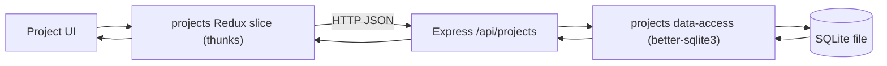

# Foundation Scaffold — Projects CRUD & Local Persistence

## Goal
Establish the runnable local skeleton for Project Todo Manager and deliver the first
vertical feature slice — Projects CRUD — end to end. After this epic, a developer can install
and start both the Express API and the Vite React/Redux app, create/list/edit/select/delete
projects through the UI, and see that data persist in a local SQLite database across restarts.
This is the base every later epic (tasks, task types, tags, search, activity, theming) builds on.

## Current Baseline
Greenfield. Only the approved requirements artifact
(`20260825_project-todo-manager_requirements.md`) exists; no code yet.

## Implementation Plan

### Repository & tooling
- Two-workspace layout: `web/` (front end) and `api/` (back end), with root-level install/run scripts.
  - File: [package.json](package.json)
  - Keep everything local; no external services required to run.

### Front end (React / Redux / TypeScript / Vite)
- Vite React+TS app with a Redux Toolkit store, typed root state, and typed `useAppSelector`/`useAppDispatch` hooks.
  - File: [web/src/store/index.ts](web/src/store/index.ts)
  - File: [web/src/store/projectsSlice.ts](web/src/store/projectsSlice.ts)
- Typed REST client used by all thunks; browser never touches SQLite directly (REQ-029).
  - File: [web/src/api/client.ts](web/src/api/client.ts)
- Projects UI: list with name + task count, create/edit form, select interaction, delete-with-confirm.
  - File: [web/src/features/projects/ProjectList.tsx](web/src/features/projects/ProjectList.tsx)
  - File: [web/src/features/projects/ProjectForm.tsx](web/src/features/projects/ProjectForm.tsx)

### Back end (Express / TypeScript / better-sqlite3)
- Express app with JSON body parsing, CORS for the Vite origin, health check, configurable port.
  - File: [api/src/server.ts](api/src/server.ts)
- SQLite bootstrap: open/create the DB file, run idempotent schema init, enable foreign keys.
  - File: [api/src/db/index.ts](api/src/db/index.ts)
- Projects schema + data-access functions and REST routes.
  - File: [api/src/db/projects.ts](api/src/db/projects.ts)
  - File: [api/src/routes/projects.ts](api/src/routes/projects.ts)

## Data Flow
Projects CRUD request path from UI to disk.

## Primary Files Expected to Change
- [package.json](package.json)
- [api/src/server.ts](api/src/server.ts)
- [api/src/db/index.ts](api/src/db/index.ts)
- [api/src/db/projects.ts](api/src/db/projects.ts)
- [api/src/routes/projects.ts](api/src/routes/projects.ts)
- [web/src/store/index.ts](web/src/store/index.ts)
- [web/src/store/projectsSlice.ts](web/src/store/projectsSlice.ts)
- [web/src/api/client.ts](web/src/api/client.ts)
- [web/src/features/projects/ProjectList.tsx](web/src/features/projects/ProjectList.tsx)
- [web/src/features/projects/ProjectForm.tsx](web/src/features/projects/ProjectForm.tsx)

## Validation
Verifies acceptance criteria AC-001–AC-006 and AC-026–AC-030 from the requirements artifact.

1. Install dependencies and start both the API and the web app with the documented commands.
2. Create a project via the UI; reload the page — it still appears (AC-001).
3. The project list shows each project with a task count (AC-002).
4. Edit a project's name/description; reload — the change persists (AC-003).
5. Select a project — the app switches to that project's context (AC-004, task list may be empty here).
6. Delete a project — a confirmation is required; after confirming it is gone and stays gone after reload (AC-005, AC-006).
7. Stop and restart the app pointing at the same SQLite file — all projects are still present (AC-027).
8. With external network access disabled, all of the above still work (AC-026).
9. Inspect network traffic: all persistence goes through `/api/projects`; the browser makes no direct DB access (AC-029).
10. Integration tests for all five endpoints pass (happy path + not-found + validation).

## Risks to manage
- better-sqlite3 is a native module — ensure it builds against the local Node version; document the Node version.
- Enable `PRAGMA foreign_keys = ON` per connection so the future tasks cascade behaves as specified.
- Keep the schema-init idempotent so restarts don't error on existing tables.
- Design the projects data-access and schema so the tasks table (next epic) can be added with a foreign key without rework.

## Out of scope
- Tasks, task types, tags, search, sorting, drag-and-drop, activity history, and theming — all handled in later epics.
- Authentication, multi-user, cloud sync, and any remote backend.
- Data import/export.
