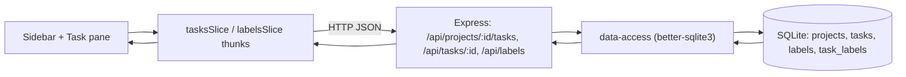

# Round 2 Core Completion — Tasks, Labels, Smart Lists & Reminders UI

## Goal
Deliver the complete round-2 scope in one epic, turning Project Todo Manager from a
projects-only skeleton into a usable, polished todo app. After this epic the user can create and
manage tasks within projects, apply a unified set of colored labels, filter and sort tasks by
label, browse tasks across all projects through Apple Reminders–style smart lists, and use a
two-pane themed UI with interaction polish — all covered by a comprehensive, single-command test
suite. Covers REQ-030–052 from the round-2 artifact.

## Current Baseline
- Monorepo: `api/` (Express + TS + better-sqlite3) and `web/` (React + Redux Toolkit + TS + Vite).
- Only a `projects` table exists (`id, name, description, created_at`); `PRAGMA foreign_keys = ON`.
- Projects REST CRUD exists; `GET /api/projects` returns `task_count` hard-coded to 0
  (`api/src/db/projects.ts`).
- Projects UI (`ProjectForm`, `ProjectList`, `DeleteConfirmDialog`) wired to `projectsSlice`;
  `App.tsx` is a flat, unstyled layout.
- Minimal tests only (`api/src/routes/projects.test.ts`, `web/src/App.test.tsx`); no styling.

## Implementation Plan
Recommended build order: Tasks → Labels + filter/sort → Smart lists → Reminders UI/theming →
finalize tests. Each phase ships its own tests.

### Phase 1 — Tasks CRUD & live count (REQ-030–036)
- Tasks table, data access, REST routes, and real project task count.
  - File: [api/src/db/index.ts](api/src/db/index.ts)
  - File: [api/src/types/task.ts](api/src/types/task.ts)
  - File: [api/src/db/tasks.ts](api/src/db/tasks.ts)
  - File: [api/src/db/projects.ts](api/src/db/projects.ts)
  - File: [api/src/routes/tasks.ts](api/src/routes/tasks.ts)
  - File: [api/src/server.ts](api/src/server.ts)
- Task web slice + UI wired to project selection.
  - File: [web/src/store/tasksSlice.ts](web/src/store/tasksSlice.ts)
  - File: [web/src/features/tasks/TaskList.tsx](web/src/features/tasks/TaskList.tsx)
  - File: [web/src/features/tasks/TaskForm.tsx](web/src/features/tasks/TaskForm.tsx)
  - File: [web/src/App.tsx](web/src/App.tsx)

### Phase 2 — Unified labels + filter/sort (REQ-037–041)
- Labels + join tables, data access, routes, web slice, and filter/sort controls.
  - File: [api/src/db/index.ts](api/src/db/index.ts)
  - File: [api/src/db/labels.ts](api/src/db/labels.ts)
  - File: [api/src/routes/labels.ts](api/src/routes/labels.ts)
  - File: [web/src/store/labelsSlice.ts](web/src/store/labelsSlice.ts)
  - File: [web/src/features/tasks/TaskList.tsx](web/src/features/tasks/TaskList.tsx)
  - Note: label filter is AND semantics; document sort tie-breaking (default incomplete-first, then title).

### Phase 3 — Cross-project smart lists (REQ-042–045)
- Cross-project queries (All, Completed, per-label) and sidebar smart lists reusing filter/sort.
  - File: [api/src/routes/tasks.ts](api/src/routes/tasks.ts)
  - File: [web/src/features/smartlists/SmartLists.tsx](web/src/features/smartlists/SmartLists.tsx)

### Phase 4 — Reminders-style UI, theming, animations (REQ-046–049)
- Two-pane layout, Reminders visuals, light/dark theme with persistence, interaction polish.
  - File: [web/src/App.tsx](web/src/App.tsx)
  - File: [web/src/features/layout/Sidebar.tsx](web/src/features/layout/Sidebar.tsx)
  - File: [web/src/styles/theme.css](web/src/styles/theme.css)

### Phase 5 — Testing (REQ-050–052)
- API and web tests shipped per phase; whole suite runs with one command.
  - File: [api/src/routes/tasks.test.ts](api/src/routes/tasks.test.ts)
  - File: [api/src/routes/labels.test.ts](api/src/routes/labels.test.ts)
  - File: [web/src/store/tasksSlice.test.ts](web/src/store/tasksSlice.test.ts)
  - File: [web/src/store/labelsSlice.test.ts](web/src/store/labelsSlice.test.ts)

## Data Flow
Representative request path (task + labels) from UI to SQLite.

## Primary Files Expected to Change
- [api/src/db/index.ts](api/src/db/index.ts)
- [api/src/types/task.ts](api/src/types/task.ts)
- [api/src/types/label.ts](api/src/types/label.ts)
- [api/src/db/tasks.ts](api/src/db/tasks.ts)
- [api/src/db/labels.ts](api/src/db/labels.ts)
- [api/src/db/projects.ts](api/src/db/projects.ts)
- [api/src/routes/tasks.ts](api/src/routes/tasks.ts)
- [api/src/routes/labels.ts](api/src/routes/labels.ts)
- [api/src/server.ts](api/src/server.ts)
- [web/src/api/client.ts](web/src/api/client.ts)
- [web/src/api/types.ts](web/src/api/types.ts)
- [web/src/store/tasksSlice.ts](web/src/store/tasksSlice.ts)
- [web/src/store/labelsSlice.ts](web/src/store/labelsSlice.ts)
- [web/src/store/index.ts](web/src/store/index.ts)
- [web/src/features/tasks/TaskList.tsx](web/src/features/tasks/TaskList.tsx)
- [web/src/features/tasks/TaskForm.tsx](web/src/features/tasks/TaskForm.tsx)
- [web/src/features/smartlists/SmartLists.tsx](web/src/features/smartlists/SmartLists.tsx)
- [web/src/features/layout/Sidebar.tsx](web/src/features/layout/Sidebar.tsx)
- [web/src/styles/theme.css](web/src/styles/theme.css)
- [web/src/App.tsx](web/src/App.tsx)
- API + web test files listed in Phase 5

## Validation
Verifies AC-030–AC-052 from the round-2 artifact.

1. Project edit persists; project list shows a live task count that updates on task add/remove (AC-030, AC-031).
2. Create task with only a title; add a note; reload — both persist (AC-032).
3. Selecting a project shows only its tasks; edit and delete a task persist (AC-033–035).
4. Toggle completion on/off; reload — state and completed styling persist (AC-036).
5. Create/rename/recolor/delete labels persist; assign multiple labels to a task and remove one — exact set persists (AC-037, AC-038).
6. Delete a label — removed from all tasks, tasks remain (AC-039).
7. Filter by one and multiple labels (AND); clear restores full list; each sort option is deterministic (AC-040, AC-041).
8. "All" shows every task with its project; "Completed" shows only completed; a label smart list shows that label's tasks across projects; filter/sort behave identically in smart lists (AC-042–045).
9. Sidebar lists smart lists + projects; selecting updates the main pane; rows show checkbox/title/note/chips; sidebar shows colored icons (AC-046, AC-047).
10. Toggle theme switches light/dark immediately and persists after reload; check-off and add/remove animate; interactive elements have hover/active states (AC-048, AC-049).
11. A single documented command runs the whole api + web suite green with no network access (AC-050–052).
12. Deleting a project cascades to its tasks and their task_labels rows.

## Risks to manage
- Large scope — keep the recommended phase order so each slice is independently verifiable; do not start the UI phase before tasks and labels exist to display.
- Keep all schema changes additive and idempotent; never alter the existing `projects` table; keep `foreign_keys = ON` so cascades fire (project→tasks→task_labels).
- SQLite has no boolean — convert `completed` INTEGER 0/1 consistently at the API boundary.
- Define and document sort tie-breaking so tests are deterministic (default: incomplete-first, then title).
- Reuse one filter/sort implementation for both project lists and smart lists to avoid divergence.
- Reminders styling must be an idiomatic look-alike only — no proprietary Apple assets.

## Out of scope
- Due dates, reminders/notifications, priority, and recurring/sub-tasks.
- Drag-and-drop manual reordering (sort is by defined keys this round).
- Per-task activity history.
- Authentication, multi-user, cloud sync, or any remote backend.
- Data import/export and mobile-native apps.
