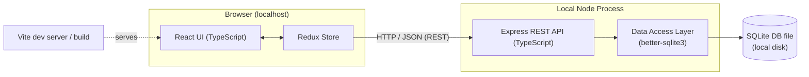
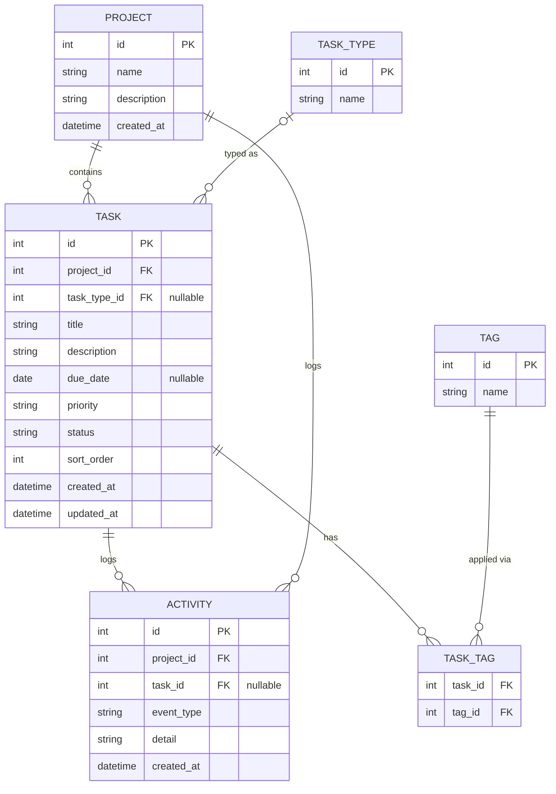
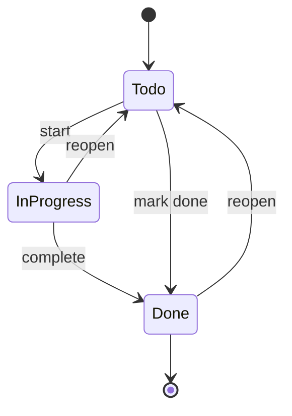

# Project Todo Manager

## Metadata
- **Artifact ID:** 20260825-001
- **Project Name:** Project Todo Manager
- **Type:** Feature Brief
- **Version:** v1.0
- **Status:** Approved
- **Owner:** Roy Wong
- **Date:** 2026-08-25
- **Source Material:** Verbal brief from stakeholder (Roy) — "todo management site that lets me organize by project, add task types, local Node app (React/Redux), local SQLite DB." Intended as a build target for a ralph-loop autonomous coding demo.

---

## Summary [Required]
Project Todo Manager is a local, single-user web application for managing todos organized by
project. It supports user-defined task-type labels, rich task metadata (due dates, priority,
status, tags), search and sorting, drag-and-drop reordering, activity history, and a dark mode.
It is built as a local Node application: a React/Redux front end (TypeScript, Vite) talking to
an Express REST API that persists all state and tasks in a local SQLite database via
better-sqlite3. The artifact is scoped to be a clean, well-bounded target for a ralph-loop
autonomous build demo.

---

## Business Context [Required]
The primary goal is to serve as a **demonstration target for a ralph-loop** — an autonomous
agentic build loop that iteratively implements a codebase against a fixed set of requirements
and acceptance criteria. The application must therefore be realistic enough to be interesting
(multiple entities, relationships, UI states, persistence) yet bounded enough that an
autonomous loop can complete it with testable, unambiguous success conditions.

Secondarily, the app has standalone utility as a personal, offline, project-oriented todo
manager that runs entirely on the local machine with no external dependencies, no accounts,
and no network sync — keeping all data private and local.

---

## Requirements [Required]

### Projects
- REQ-001: The user can create a project with a name and optional description.
- REQ-002: The user can view a list of all projects.
- REQ-003: The user can rename and edit a project's description.
- REQ-004: The user can delete a project; deleting a project deletes (or reassigns per the
  confirmed rule in AC-006) its tasks.
- REQ-005: The user can select a project to view only the tasks belonging to it.

### Tasks
- REQ-006: The user can create a task within a project with, at minimum, a title.
- REQ-007: A task can optionally carry a description, a task type, a due date, a priority, a
  status, and zero or more tags.
- REQ-008: The user can edit any field of an existing task.
- REQ-009: The user can delete a task.
- REQ-010: The user can move a task from one project to another.
- REQ-011: The user can change a task's status through a workflow of Todo → In Progress → Done
  (and back), and can mark a task done directly.

### Task Types (user-defined labels)
- REQ-012: The user can create, rename, and delete task-type labels (e.g. Bug, Chore, Idea).
- REQ-013: The user can assign exactly one task type to a task, or leave it untyped.
- REQ-014: Task types are simple named labels with no per-type fields or behavior; deleting a
  type unsets it on any tasks using it (tasks are not deleted).
- REQ-015: The user can filter tasks by task type.

### Tags
- REQ-016: The user can add and remove free-form tags on a task.
- REQ-017: The user can filter tasks by one or more tags.

### Organization, search, and sorting
- REQ-018: The user can filter the task list by project, status, task type, and tag(s).
- REQ-019: The user can full-text search tasks by title and description within the current view.
- REQ-020: The user can sort the task list by due date, priority, status, title, or manual order.
- REQ-021: The user can reorder tasks within a project via drag-and-drop, and the manual order
  is persisted.

### Activity history
- REQ-022: The system records an activity entry for task and project lifecycle events (created,
  updated, status changed, moved, deleted).
- REQ-023: The user can view the activity history for a given task and a chronological activity
  feed for a project.

### Appearance
- REQ-024: The user can toggle between light and dark mode, and the preference is persisted.

### Platform & persistence
- REQ-025: The application runs entirely locally with no external network calls required for
  core functionality.
- REQ-026: All projects, tasks, task types, tags, ordering, activity history, and the theme
  preference are persisted in a local SQLite database and survive application restarts.
- REQ-027: The front end is React with Redux for state management, written in TypeScript, and
  built/served with Vite.
- REQ-028: The back end is a Node/Express REST API in TypeScript that owns all SQLite access via
  the better-sqlite3 driver.
- REQ-029: The React app reads and writes all persistent data exclusively through the Express
  REST API (no direct DB access from the browser).

---

## Acceptance Criteria [Required]

### Projects
- AC-001 (REQ-001): Creating a project with a name persists it and it appears in the project
  list after a page reload.
- AC-002 (REQ-002): The project list displays every persisted project with its name and a task
  count.
- AC-003 (REQ-003): Editing a project's name/description persists and is reflected after reload.
- AC-004 (REQ-005): Selecting a project shows only that project's tasks and no others.
- AC-005 (REQ-004): Deleting a project removes it from the list and it does not reappear after
  reload.
- AC-006 (REQ-004): On project deletion, the user is prompted to confirm, and all tasks
  belonging to that project are deleted (cascade). This is the confirmed deletion rule.

### Tasks
- AC-007 (REQ-006): A task created with only a title is persisted and appears in its project.
- AC-008 (REQ-007): A task saved with description, type, due date, priority, status, and tags
  retains all of those values after reload.
- AC-009 (REQ-008): Editing any task field persists the change and is reflected after reload.
- AC-010 (REQ-009): Deleting a task removes it from the list and it does not reappear after
  reload.
- AC-011 (REQ-010): Moving a task to another project makes it appear under the target project
  and disappear from the source project.
- AC-012 (REQ-011): Changing a task's status persists the new status; marking a task done sets
  status to Done and visibly distinguishes it (e.g. strikethrough / done styling).

### Task Types
- AC-013 (REQ-012): Creating, renaming, and deleting a task type each persist and are reflected
  after reload.
- AC-014 (REQ-013): A task can be assigned at most one task type; the assignment persists.
- AC-015 (REQ-014): Deleting a task type unsets it on all tasks that referenced it, and those
  tasks remain present (not deleted).
- AC-016 (REQ-015): Filtering by a task type shows only tasks assigned that type.

### Tags
- AC-017 (REQ-016): Adding and removing tags on a task persists and is reflected after reload.
- AC-018 (REQ-017): Filtering by one or more tags shows only tasks carrying all selected tags.

### Search, filter, sort, reorder
- AC-019 (REQ-018): Applying project, status, type, and tag filters (individually and combined)
  returns only tasks matching every active filter.
- AC-020 (REQ-019): Searching a term returns only tasks whose title or description contains that
  term (case-insensitive) within the current view.
- AC-021 (REQ-020): Selecting each sort option reorders the visible list accordingly.
- AC-022 (REQ-021): Dragging a task to a new position updates its order, and the new order
  persists after reload.

### Activity history
- AC-023 (REQ-022): Creating, updating, changing status of, moving, and deleting a task each
  generate a distinct, timestamped activity entry.
- AC-024 (REQ-023): The task activity view lists that task's events newest-first; the project
  activity feed lists all events for the project newest-first.

### Appearance
- AC-025 (REQ-024): Toggling dark mode changes the theme immediately and the chosen theme is
  restored after reload.

### Platform & persistence
- AC-026 (REQ-025): With external network access disabled, all core flows (create/read/update/
  delete projects, tasks, types, tags; filter; sort; reorder; view history; toggle theme) work.
- AC-027 (REQ-026): After stopping and restarting the app, all previously entered data and the
  theme preference are present and correct.
- AC-028 (REQ-027 / REQ-028): The repository builds and runs with a documented command set
  (e.g. install, start API, start web); the web app is a Vite-served React/Redux TypeScript app
  and the API is an Express TypeScript service.
- AC-029 (REQ-029): The browser makes no direct SQLite access; all persistence occurs through
  documented REST endpoints served by the Express API.
- AC-030 (REQ-028): The Express API uses better-sqlite3 for all database reads and writes.

---

## Diagrams [Recommended]

### System Architecture
End-to-end local architecture: the React/Redux SPA calls the Express REST API, which owns the
SQLite database file through better-sqlite3.

### Data Model
Core entities and their relationships. A project has many tasks; a task optionally references
one task type and has many tags and many activity entries.

### Task Status Workflow
The status lifecycle a task moves through.

---

## Scope [Required]

### In scope
- Full CRUD for projects, tasks, and user-defined task-type labels.
- Organize and filter tasks by project, status, task type, and tag(s).
- Task metadata: title, description, due date, priority, status, tags.
- Full-text search over task title and description.
- Sorting (due date, priority, status, title, manual) and drag-and-drop manual reordering.
- Activity history per task and per project.
- Light/dark theme toggle with persisted preference.
- Local persistence of all data in SQLite via better-sqlite3.
- React/Redux + TypeScript front end (Vite) and Express TypeScript REST API back end.
- Documented local run/build commands.

### Out of scope
- User accounts, authentication, and multi-user support (single local user only).
- Cloud sync, hosting, or any remote backend.
- Real-time collaboration or multi-device sync.
- Notifications, reminders, or email/calendar integration.
- Mobile-native apps (the web UI need not be optimized for mobile).
- Recurring tasks and sub-tasks.
- File attachments on tasks.
- Import/export of data (may be a future enhancement).
- Internationalization/localization.

---

## Constraints [Recommended]
- Must run entirely on the local machine; no external network calls required for core features.
- Front end: React with Redux, TypeScript, built and served with Vite.
- Back end: Node/Express in TypeScript.
- Persistence: local SQLite database accessed exclusively via better-sqlite3 in the API layer.
- The browser must not access SQLite directly; all persistence flows through the REST API.
- Scope and acceptance criteria are intentionally bounded and testable to suit an autonomous
  ralph-loop build.

---

## Dependencies [Recommended]
- Node.js runtime (local).
- npm (or compatible package manager) for dependency installation.
- React, Redux (Redux Toolkit recommended), and a drag-and-drop library for reordering.
- Express and better-sqlite3.
- Vite and TypeScript toolchain.
- A test framework for acceptance verification (e.g. Vitest/Jest + an API/integration test
  runner) so the ralph-loop can verify acceptance criteria automatically.

---

## Stakeholders [Recommended]
| Name     | Role                        | Interest                                             |
| -------- | --------------------------- | ---------------------------------------------------- |
| Roy Wong | Owner / Stakeholder         | Defines requirements; runs the ralph-loop demo       |
| Ralph-loop agent | Autonomous builder  | Consumes requirements + acceptance criteria to build |

---

## Open Questions [Optional]
| ID     | Question                                                                                      | Owner | Due |
| ------ | -------------------------------------------------------------------------------------------- | ----- | --- |
| OQ-001 | Preferred drag-and-drop library (e.g. dnd-kit vs react-beautiful-dnd)? Default left to build. | Roy   | TBD |
| OQ-002 | Priority scale — three levels (Low/Medium/High) or numeric? Assumed three levels unless changed. | Roy | TBD |
| OQ-003 | Should activity history be user-clearable, or immutable audit log? Assumed immutable.         | Roy   | TBD |

---

## Source References
- Verbal stakeholder brief from Roy Wong (2026-08-25).
- Interview clarifications: Project Name = "Project Todo Manager"; task types = user-defined
  labels; scope = full-featured; stack = TypeScript, Vite, Express API layer, better-sqlite3.

---
*This artifact was produced collaboratively with the Claude artifact agent.*
