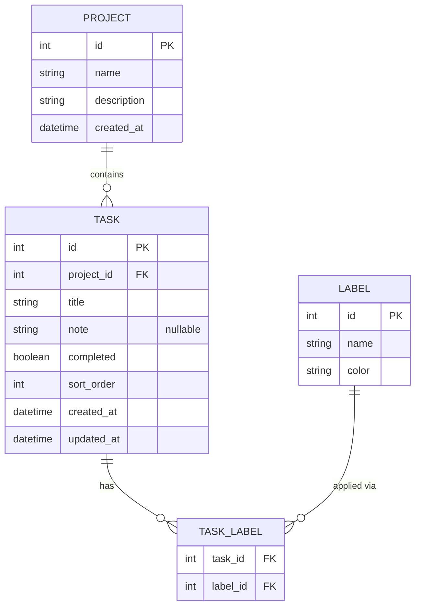
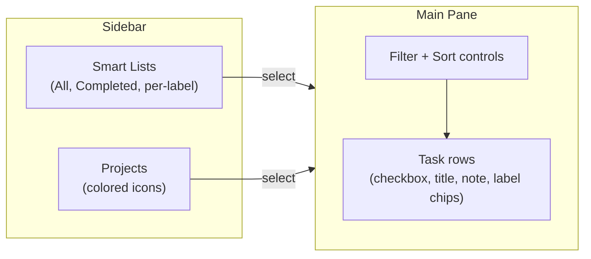
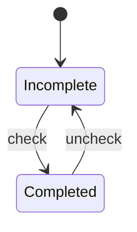

# Project Todo Manager — Round 2 (Core Completion)

## Metadata
- **Artifact ID:** 20260827-001
- **Project Name:** Project Todo Manager
- **Type:** Feature Brief
- **Version:** v1.1
- **Status:** Approved
- **Owner:** Roy Wong
- **Date:** 2026-08-27
- **Source Material:** Verbal round-2 brief from Roy (full project editing, tasks within projects, unified labels, sort/filter by label, cross-project smart lists, unit tests, Apple Reminders styling); the approved v1 artifact (`20260825_project-todo-manager_requirements.md`); and the current codebase state (epic-001 foundation scaffold as built).

---

## Summary [Required]
This artifact defines the second round of development for Project Todo Manager — completing the
core product the v1 vision intended. Building on the delivered foundation (monorepo, Projects
CRUD, SQLite persistence), it adds tasks within projects, a unified **labels** concept
(replacing v1's separate "task types" and "tags"), sorting and filtering tasks by label, a
cross-project **smart-lists** view in the style of Apple Reminders, comprehensive unit tests,
and an Apple Reminders–style UI (sidebar layout, light/dark themes, and interaction polish).

---

## Business Context [Required]
The v1 foundation stands up the app skeleton and Projects CRUD, but the product is not yet
usable as a todo manager: there are no tasks. This round delivers the features that make it a
real, demoable application and continues to serve as a bounded, testable target for the
ralph-loop autonomous build. It also raises quality (unit-test coverage) and elevates the
experience to a familiar, polished standard (Apple Reminders) so the demo is compelling.

---

## Current Baseline (as built) [Reference]
This round builds directly on what already exists. The requirements below assume this baseline
and must not re-implement it except where they explicitly extend or harden it.

- **Repo & stack:** Monorepo with `api/` (Express + TypeScript + better-sqlite3) and `web/`
  (React + Redux Toolkit + TypeScript + Vite). Matches the approved stack.
- **Database:** One `projects` table only — `id, name, description, created_at`. Foreign keys
  are enabled (`PRAGMA foreign_keys = ON`). No tasks or labels tables yet.
- **Projects API:** Full REST CRUD exists — `POST /api/projects`, `GET /api/projects`
  (with a `task_count` field currently hard-coded to 0), `GET /api/projects/:id`,
  `PUT /api/projects/:id`, `DELETE /api/projects/:id`.
- **Projects UI:** `ProjectForm` (create + edit name/description), `ProjectList`, and
  `DeleteConfirmDialog` exist and are wired to the Redux `projectsSlice`.
- **Tests:** Minimal — `api/src/routes/projects.test.ts` and `web/src/App.test.tsx`.
- **Styling:** None — unstyled default HTML.

> **Terminology change (supersedes v1):** v1 defined two separate concepts — user-defined
> *task types* (one per task, REQ-012–015) and free-form *tags* (many per task, REQ-016–017).
> This round **unifies both into a single `labels` concept**: a task may carry many labels.
> Since no task/type/tag code was built in v1, there is no migration — the unified model is
> adopted directly. REQ-012–017 from v1 are considered superseded by REQ-037–039 below.

---

## Requirements [Required]
Requirement IDs continue the v1 series (which ended at REQ-029) to avoid collisions.

### Full project editing (harden existing)
- REQ-030: The user can fully edit an existing project's name and description from the UI, with
  changes persisted via `PUT /api/projects/:id` and reflected immediately in the list.
- REQ-031: The project list displays an accurate live task count per project (replacing the
  hard-coded 0), derived from the tasks table.

### Tasks within projects
- REQ-032: The user can create a task within a project with, at minimum, a title, and optionally
  a note/description.
- REQ-033: The user can view all tasks belonging to a selected project.
- REQ-034: The user can edit a task's title and note.
- REQ-035: The user can delete a task.
- REQ-036: The user can mark a task complete and incomplete (toggle), and completion state is
  persisted.

### Unified labels
- REQ-037: The user can create, rename, delete, and color labels; labels are managed in one
  user-defined list.
- REQ-038: The user can assign zero or more labels to a task and remove labels from a task;
  assignments persist (many-to-many).
- REQ-039: Deleting a label removes it from all tasks it was applied to without deleting those
  tasks.

### Sort & filter by label
- REQ-040: The user can filter the visible task list by one or more labels (a task matches when
  it carries all selected labels).
- REQ-041: The user can sort the visible task list by label, and by at least title and
  completion state, with a stable, defined ordering.

### Cross-project smart lists (Apple Reminders style)
- REQ-042: The app provides an "All" smart list showing every task across all projects, each row
  indicating which project it belongs to.
- REQ-043: The app provides a "Completed" smart list showing all completed tasks across projects.
- REQ-044: The app provides a per-label smart list: selecting a label shows all tasks carrying
  that label across all projects.
- REQ-045: Smart lists honor the same label filter and sort controls as project task lists.

### Apple Reminders–style UI
- REQ-046: The app uses a two-pane layout — a left sidebar listing smart lists and projects, and
  a main pane showing the selected list's tasks.
- REQ-047: Tasks render as Reminders-style rows with a circular checkbox, title, optional note,
  and colored label chips; projects and labels show colored icons/dots in the sidebar.
- REQ-048: The app supports light and dark themes consistent with the Apple Reminders aesthetic,
  and the chosen theme persists across restarts.
- REQ-049: Core interactions are animated and polished — check-off transitions, hover/active
  states, and smooth add/remove of rows.

### Testing
- REQ-050: Unit/integration tests cover all API endpoints (projects, tasks, labels) including
  happy paths and error cases (validation, not-found, cascade behavior).
- REQ-051: Unit tests cover the web app's Redux slices and key components (task toggle, label
  assignment, filtering/sorting, smart-list selection).
- REQ-052: The full test suite runs with a single documented command and passes.

---

## Acceptance Criteria [Required]

### Full project editing
- AC-030 (REQ-030): Editing a project's name and description in the UI persists and is reflected
  after reload.
- AC-031 (REQ-031): A project showing N tasks displays task count N in the list; adding/removing
  a task updates the count.

### Tasks within projects
- AC-032 (REQ-032): Creating a task with only a title persists it under its project and it
  appears after reload; a note can be added and is retained.
- AC-033 (REQ-033): Selecting a project shows exactly that project's tasks and no others.
- AC-034 (REQ-034): Editing a task's title/note persists and is reflected after reload.
- AC-035 (REQ-035): Deleting a task removes it and it does not reappear after reload.
- AC-036 (REQ-036): Toggling completion persists the state; a completed task renders in its
  completed style and can be toggled back to incomplete.

### Unified labels
- AC-037 (REQ-037): Creating, renaming, recoloring, and deleting a label each persist and are
  reflected after reload.
- AC-038 (REQ-038): Assigning multiple labels to a task and removing one persists the exact
  resulting set after reload.
- AC-039 (REQ-039): Deleting a label removes it from every task that had it, and those tasks
  remain present.

### Sort & filter by label
- AC-040 (REQ-040): Filtering by one label shows only tasks with it; filtering by multiple shows
  only tasks carrying all selected labels; clearing filters restores the full list.
- AC-041 (REQ-041): Each sort option reorders the visible list deterministically (documented tie-breaking).

### Cross-project smart lists
- AC-042 (REQ-042): The "All" list shows every task from every project, each row labeled with its
  project name.
- AC-043 (REQ-043): The "Completed" list shows all and only completed tasks across projects.
- AC-044 (REQ-044): Selecting a label smart list shows all tasks carrying that label across all
  projects.
- AC-045 (REQ-045): Label filter and sort controls work identically in smart lists and in
  project task lists.

### Apple Reminders–style UI
- AC-046 (REQ-046): The sidebar lists smart lists and all projects; selecting any entry updates
  the main pane to that list's tasks.
- AC-047 (REQ-047): Task rows show a circular checkbox, title, optional note, and colored label
  chips; sidebar entries show colored icons/dots.
- AC-048 (REQ-048): Toggling theme switches light/dark immediately and the choice is restored
  after reload.
- AC-049 (REQ-049): Checking a task plays a visible completion transition; rows animate on
  add/remove; interactive elements have hover/active states.

### Testing
- AC-050 (REQ-050): API tests exist and pass for projects, tasks, and labels, covering success,
  validation errors, not-found, and cascade/label-removal behavior.
- AC-051 (REQ-051): Web tests exist and pass for the Redux slices and the key components named
  in REQ-051.
- AC-052 (REQ-052): A single documented command runs the whole suite green; the run is
  reproducible locally with no network access.

---

## Diagrams [Recommended]

### Updated Data Model
The unified model: projects have many tasks; tasks have many labels via a join table; labels are
a single user-managed set. (Extends the existing `projects` table; adds `tasks`, `labels`,
`task_labels`.)

### UI Layout & Navigation (Reminders-style)
Two-pane layout: sidebar of smart lists + projects on the left, task pane on the right.

### Task Completion State
The completion toggle a task moves through.

---

## Scope [Required]

### In scope
- Hardening full project editing and a live per-project task count.
- Tasks within projects: create, view, edit, delete, complete/incomplete toggle.
- Unified labels: create/rename/recolor/delete; many labels per task.
- Filter and sort tasks by label (plus title and completion).
- Cross-project smart lists: All, Completed, and per-label.
- Apple Reminders–style UI: two-pane sidebar layout, colored icons/label chips, circular
  checkboxes, light/dark themes with persistence, and interaction animations.
- Comprehensive API and web unit/integration tests runnable with one command.

### Out of scope
- Due dates, reminders/notifications, priority, and recurring/sub-tasks (not this round).
- Drag-and-drop manual reordering (deferred; sort is by defined keys this round).
- Per-task activity history (deferred from v1).
- Authentication, multi-user, cloud sync, or any remote backend.
- Data import/export and mobile-native apps.
- Migration tooling (none needed — no prior task/label data exists).

### Superseded from v1
- v1 REQ-012–015 (user-defined task types, one per task) and REQ-016–017 (free-form tags) are
  replaced by the unified labels model (REQ-037–039).

---

## Constraints [Recommended]
- Must continue to run entirely locally; no external network calls required for core features.
- Must build on the existing monorepo and stack (React/Redux + TS + Vite; Express + TS;
  better-sqlite3) — no stack changes.
- Browser must never access SQLite directly; all persistence flows through the Express REST API.
- Schema changes must be additive and idempotent, preserving the existing `projects` table and
  keeping `PRAGMA foreign_keys = ON` so task/label cascades behave as specified.
- Visual design should be recognizably in the Apple Reminders idiom without copying proprietary
  assets.

---

## Dependencies [Recommended]
- Existing epic-001 foundation (delivered).
- A web test setup (already present: Vitest + Testing Library via `setupTests.ts`) extended to
  cover the new slices/components.
- An API test runner (already present for projects) extended to tasks and labels.
- A lightweight styling approach (CSS/CSS-modules or a small utility layer) capable of the
  Reminders look, sidebar layout, theming, and animations.

---

## Stakeholders [Recommended]
| Name             | Role                | Interest                                              |
| ---------------- | ------------------- | ---------------------------------------------------- |
| Roy Wong         | Owner / Stakeholder | Defines requirements; runs the ralph-loop demo        |
| Ralph-loop agent | Autonomous builder  | Consumes requirements + acceptance criteria to build  |

---

## Open Questions [Optional]
| ID     | Question                                                                                          | Owner | Due |
| ------ | ------------------------------------------------------------------------------------------------ | ----- | --- |
| OQ-004 | Label colors — fixed palette (e.g. Reminders' set) or free color picker? Assumed a fixed palette. | Roy   | TBD |
| OQ-005 | Default sort for task lists — manual not in scope, so default to incomplete-first then title?     | Roy   | TBD |
| OQ-006 | Should "Completed" smart list allow clearing/deleting completed tasks in bulk? Assumed no for now. | Roy   | TBD |

---

## Source References
- Verbal round-2 brief from Roy Wong (2026-08-27).
- Approved v1 artifact: `20260825_project-todo-manager_requirements.md`.
- Codebase baseline: `api/src/db/index.ts`, `api/src/db/projects.ts`, `api/src/routes/projects.ts`,
  `web/src/App.tsx`, and the `web/src/features/projects/*` components (as built for epic-001).

---
*This artifact was produced collaboratively with the Claude artifact agent.*
